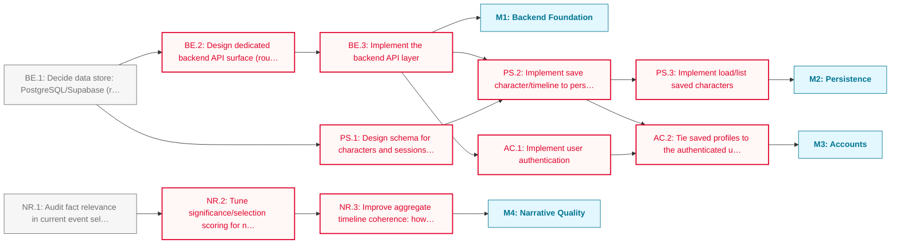

# Epoch PHASE_1 Roadmap

This phase moves Epoch beyond a stateless SvelteKit demo: a dedicated backend, persisted characters, and user accounts, alongside independent work on the quality of the generated narrative itself.

**Critical path:** `BE.1 → BE.2 → BE.3 → PS.2 → AC.2`; the data-store decision gates everything backend-shaped, and `AC.2` (ownership of saved profiles) is the last task before accounts are usable end-to-end. `NR.1 → NR.2 → NR.3` runs independently and can proceed in parallel with the backend track.

---

## Milestone 1: Backend Foundation

**Goal:** Decide on a data store and stand up a dedicated backend API to replace SvelteKit-only server routes.

- [ ] **BE.1**: Decide data store: PostgreSQL/Supabase (relational, RLS) vs Neo4j (graph) vs other, based on how characters/sessions/timelines will actually be queried
- [ ] **BE.2**: Design dedicated backend API surface (routes/contracts) to replace the current SvelteKit server-side form actions _(blocked: depends on BE.1)_
- [ ] **BE.3**: Implement the backend API layer _(blocked: depends on BE.2)_

---

## Milestone 2: Persistence

**Goal:** Persist characters and their generated timelines/sessions to the chosen data store.

- [ ] **PS.1**: Design schema for characters and sessions (fields, relations to events/timeline data) _(blocked: depends on BE.1)_
- [ ] **PS.2**: Implement save character/timeline to persistent storage _(blocked: depends on PS.1, BE.3)_
- [ ] **PS.3**: Implement load/list saved characters _(blocked: depends on PS.2)_

---

## Milestone 3: Accounts

**Goal:** Add user authentication and tie saved profiles to authenticated users.

- [ ] **AC.1**: Implement user authentication _(blocked: depends on BE.3)_
- [ ] **AC.2**: Tie saved profiles to the authenticated user (ownership checks; Row-Level Security if the data store is Postgres/Supabase) _(blocked: depends on AC.1, PS.2)_

---

## Milestone 4: Narrative Quality

**Goal:** Improve the relevance of chosen facts and the coherence of timelines when read in aggregate. Independent of the backend/persistence work; can run in parallel.

- [ ] **NR.1**: Audit fact relevance in current event selection: identify patterns behind irrelevant or low-value events being surfaced
- [ ] **NR.2**: Tune significance/selection scoring for narrative relevance based on the audit findings _(blocked: depends on NR.1)_
- [ ] **NR.3**: Improve aggregate timeline coherence: how selected events read together as a connected narrative, not just individually scored entries _(blocked: depends on NR.2)_

---

## Dependency Diagram

